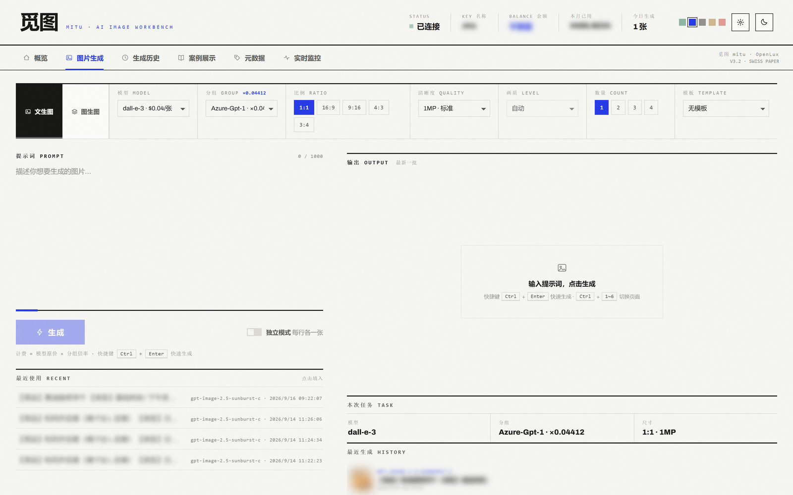
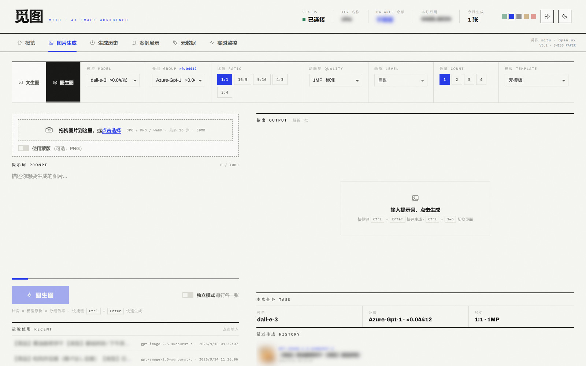
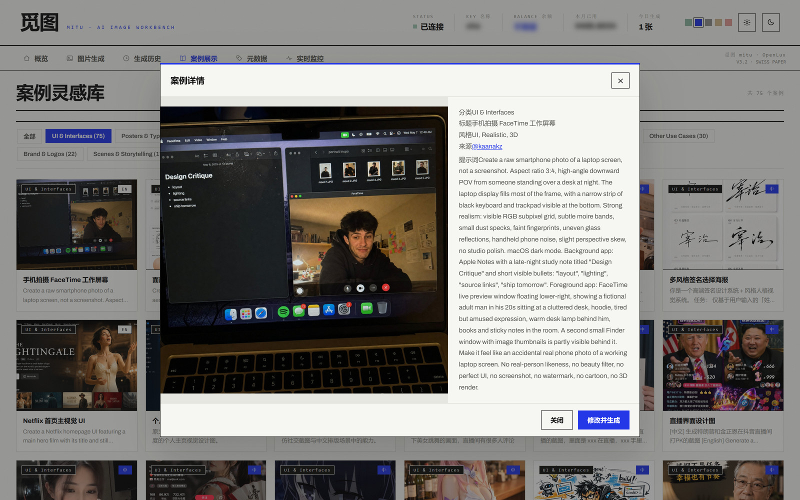
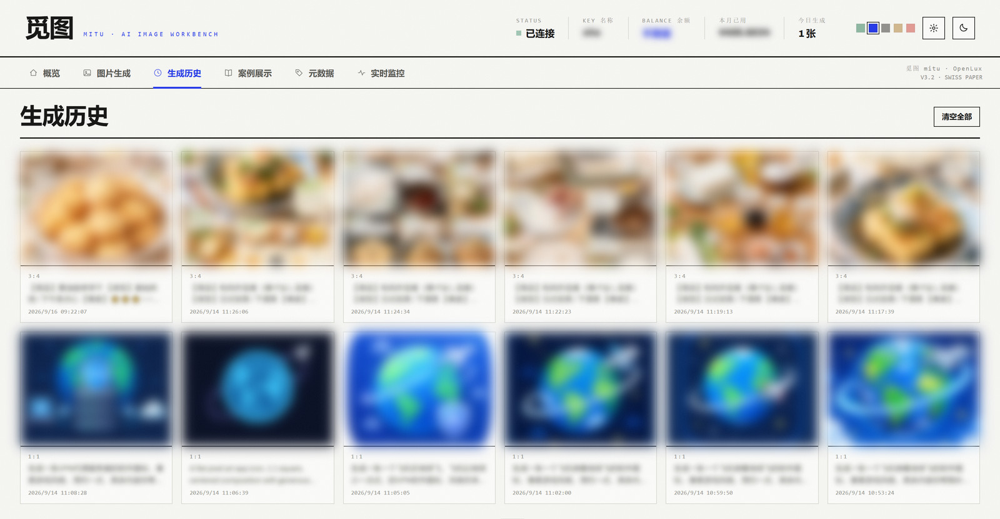
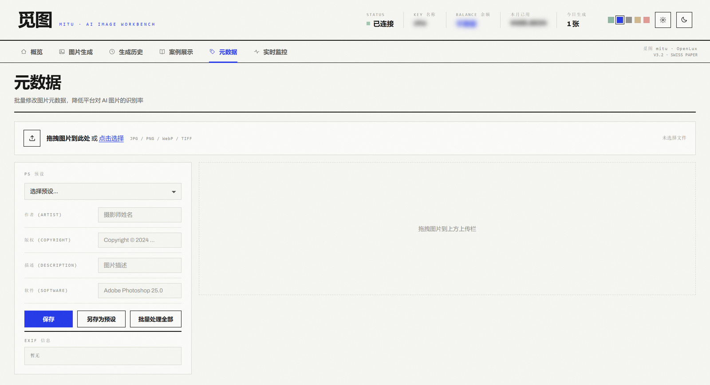
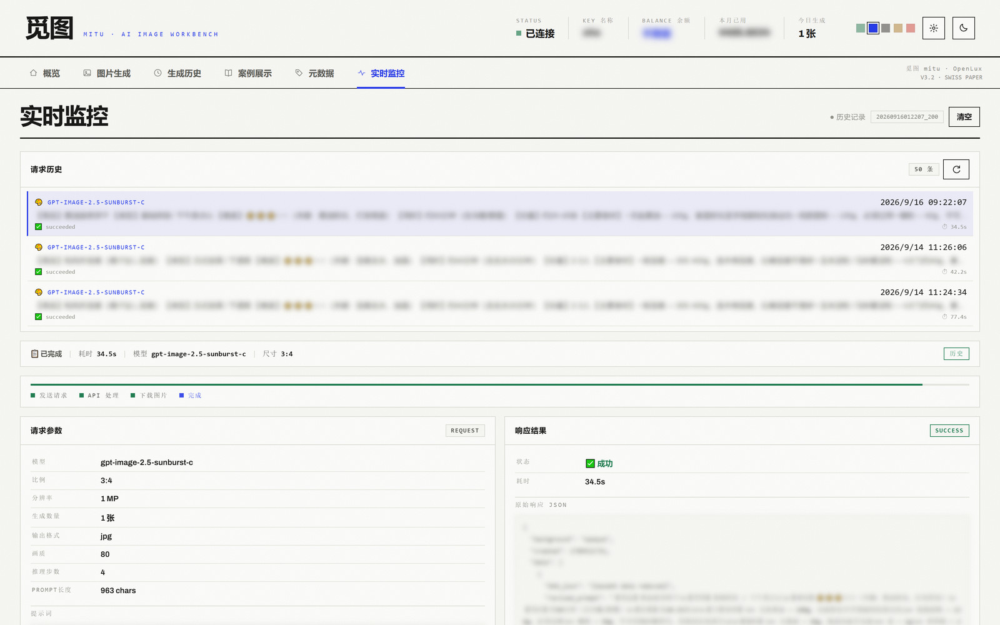
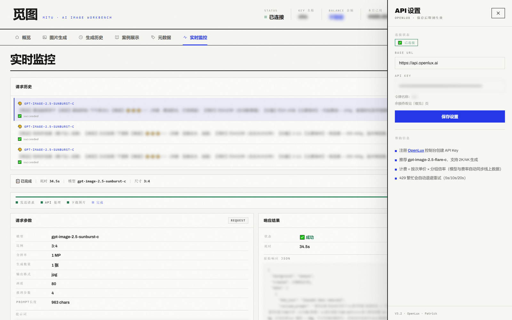

<div align="center">

# 觅图 mitu

**AI 图片生成工作台 · 基于 GPT-Image 系列模型**

文生图 · 图生图 · 案例灵感库 · 元数据工坊 · 实时监控

[](https://www.python.org/)
[](https://fastapi.tiangolo.com/)
[](https://github.com/Patrick-mufeng/image2-web)
[](./LICENSE)


</div>

---

## 目录

- [快速开始](#快速开始)
- [功能特性](#功能特性)
- [界面预览](#界面预览)
- [技术栈](#技术栈)
- [项目结构](#项目结构)
- [接入说明](#接入说明)
- [常见问题](#常见问题)

---

## 快速开始

### 1. 获取 API Key

前往 OpenLux 注册并创建令牌：

> **注册链接**：<https://api.openlux.ai/register?aff=b3En>

注册后在控制台创建 **API Key（令牌）**。建议创建 `gpt-image-2.5` 或 `gpt-image-2` 类型令牌，生成时选择对应分组可获得更高性价比。

### 2. 克隆项目

```bash
git clone https://github.com/Patrick-mufeng/image2-web.git
cd image2-web
```

### 3. 配置 API Key

复制配置模板并填入你的 Key：

```bash
cp .env.example .env
```

编辑 `.env`：

```ini
OPENLUX_API_KEY=sk-your-api-key-here
OPENLUX_BASE_URL=https://api.openlux.ai
```

> 也可以在启动后点击界面右上角的 **⚙ API 设置** 填写，保存即刻生效。

### 4. 启动

双击 `start.bat` 即可，浏览器会自动打开 <http://localhost:8000>。

> 项目已内置嵌入式 Python 3.11.9 与全部依赖，**无需手动安装 Python 环境**。

<details>
<summary>手动启动（开发者）</summary>

```bash
pip install -r requirements.txt
python -m uvicorn backend.main:app --host 0.0.0.0 --port 8000
```

</details>

---

## 功能特性

<table>
<tr>
<td width="50%" valign="top">

### 🎨 图片生成

- **模型自动同步**：启动时拉取线上 `/v1/models` + `/api/pricing`，模型、分组、费率实时更新，无需改代码
- **5 种比例**：1:1 / 16:9 / 9:16 / 4:3 / 3:4
- **3 级分辨率**：1MP / 2MP / 4MP，尺寸自动符合 16px 倍数与总像素上限
- **画质档位**：auto / low / medium / high / xhigh / max，按模型能力动态显示
- **独立提示词模式**：每行各生成一张图
- **风格模板库**：22 套模板 / 13 种分类
- 实时日志与进度条全程可见，出图中位耗时约 50 秒

</td>
<td width="50%" valign="top">

### 🖼️ 图生图

- 拖拽上传图片进行 AI 编辑
- 支持单图 / 多图编辑（最多 16 张）
- 可选蒙版上传（PNG）
- 支持 `gpt-image-2.5` / `gpt-image-2` / `gpt-image-1` 等模型
- 尺寸按模型能力自动收敛，避免参数被上游拒绝

</td>
</tr>
<tr>
<td valign="top">

### 📜 生成历史

- 自动保存全部生成记录
- 网格展示，点击查看大图
- 保留完整提示词，**一键载入参数重新生成**

</td>
<td valign="top">

### 📚 案例灵感库

- 内置 **487 个**精选案例，覆盖 13 个分类（含 **274 条中文提示词**）
- 分类筛选 + 中英文语言筛选
- 一键把案例提示词载入生成面板

</td>
</tr>
<tr>
<td valign="top">

### 💿 元数据工坊

- 拖拽图片批量修改 EXIF 信息
- PS 预设一键套用
- **另存为预设**，自定义预设永久保存
- 批量处理后打包下载 ZIP

</td>
<td valign="top">

### 📡 实时监控

- 每步操作的实时日志流
- 请求 / 响应 JSON 完整展示
- 错误信息含完整请求上下文与服务器响应
- 分步耗时统计：发送请求 → API 处理 → 下载图片 → 完成

</td>
</tr>
<tr>
<td valign="top">

### 💰 余额查询

- 一键查询 API Key 余额
- 显示令牌名称、本月用量、剩余额度
- 点击 Key 设置标签自动刷新

</td>
<td valign="top">

### 🎛️ 界面与主题

- 温暖极简（Warm Minimal）· 暖白 + 大地色系
- 浅色 / 深色主题切换（localStorage 持久化）
- 5 套强调色：森林 / 钴蓝 / 墨黑 / 赭石 / 瑞士红

</td>
</tr>
</table>

---

## 界面预览

### 图片生成

左侧提示词、右侧结果，顶部一排参数控件；模型与分组费率自动同步线上。



### 图生图

拖拽上传 + 可选的蒙版编辑，支持多图批量处理。



### 案例灵感库

487 个案例，13 个分类，中英文双语筛选。点击任意案例可直接载入提示词。


<details>
<summary>查看案例详情弹窗</summary>



</details>

### 生成历史

全部生成记录自动保存，保留完整提示词，可一键载入参数重新生成。



### 元数据工坊

批量修改 EXIF，套用 PS 预设，处理完打包下载。



### 实时监控

请求/响应 JSON 完整可见，含分步耗时统计与错误上下文。



### API 设置

右上角齿轮打开，保存即刻生效；换 Key 后模型与分组目录自动重建。



### 深色主题

一键切换浅色 / 深色，偏好本地持久化。


---

## 技术栈

| 层 | 技术 |
|:---|:---|
| 后端 | Python 3.11 · FastAPI 0.115 |
| 前端 | 原生 HTML + CSS + JavaScript（SPA，无框架） |
| 存储 | JSON 文件（`data/` 目录） |
| 运行时 | 嵌入式 Python 3.11.9（免安装） |
| 上游 | OpenLux（OpenAI 兼容通道） |

---

## 项目结构

```
image2-web/
├── backend/
│   ├── main.py                  # FastAPI 应用入口
│   ├── config.py                # 配置管理（.env 读写）
│   ├── models.py                # Pydantic 数据模型
│   ├── routers/
│   │   ├── generation.py        # 文生图
│   │   ├── edits.py             # 图生图
│   │   ├── history.py           # 历史记录
│   │   ├── cases.py             # 案例展示
│   │   ├── metadata.py          # 元数据
│   │   ├── templates.py         # 风格模板
│   │   └── config_routes.py     # 配置 / 模型目录 / 余额
│   ├── services/
│   │   ├── openlux_client.py    # OpenLux API 客户端
│   │   ├── model_catalog.py     # 模型×分组×费率动态目录
│   │   ├── task_manager.py      # 异步任务管理
│   │   ├── history_store.py     # 历史存储
│   │   ├── log_store.py         # 日志存储
│   │   ├── image_utils.py       # 图片处理
│   │   └── ...
│   └── static/                  # 前端静态文件
│       ├── index.html
│       ├── css/style.css
│       └── js/app.js
├── data/                        # 数据目录
│   ├── cases.json               # 案例库（487 条）
│   ├── style-library.json       # 风格模板库（22 套）
│   ├── case_images/             # 案例图片
│   └── user_presets.json        # 用户自定义预设
├── docs/screenshots/            # README 截图
├── python/                      # 嵌入式 Python 3.11.9
├── start.bat                    # 一键启动
├── requirements.txt
└── .env.example                 # 配置模板
```

---

## 接入说明

### 模型与分组

模型列表与分组费率**不写死在代码里**，启动时从线上拉取：

| 接口 | 用途 |
|:---|:---|
| `GET /v1/models` | 当前令牌实际可用的模型 |
| `GET /api/pricing` | 各模型单价、启用分组、分组费率表 |

拉取结果缓存 10 分钟；失败时回退到内置兜底表。**分组是令牌级属性**（建令牌时选定），界面上的分组下拉仅用于筛选与费率预估，请求本身不传分组。

### 计费

计费 = 模型单价 × 分组倍率。界面上会实时显示当前模型单价与所选分组倍率。

### 尺寸规则

生成尺寸自动满足上游约束：最大边 ≤ 3840px、宽高均为 16px 倍数、长宽比 ≤ 3:1、总像素 655,360 ~ 8,294,400。仅支持固定档位的模型（如 `gpt-image-2-c`）会自动收敛到合规尺寸并在日志中提示。

### 稳定性

- 遇到 `429`（上游繁忙）自动退避重试：5s / 10s / 20s
- 参数被上游拒绝时自动回退最小参数集重试一次
- 响应兼容 `data[]` 与 `choices[]` 两种结构
- 解析不出图片时显式报错并附完整响应，不会静默成功

---

## 常见问题

<details>
<summary><b>提示「请先配置 API Key」</b></summary>

点击右上角 **⚙ API 设置** 填入 Key 并保存，或直接编辑项目根目录的 `.env` 文件后重启。
</details>

<details>
<summary><b>模型列表显示为兜底数据（source: fallback）</b></summary>

说明线上目录拉取失败，通常是网络无法访问 `api.openlux.ai`。检查代理设置，或确认 `OPENLUX_BASE_URL` 填写正确（不要带 `/v1` 后缀，程序会自动处理）。
</details>

<details>
<summary><b>生成失败，提示 429 / 上游繁忙</b></summary>

上游并发限制。程序已自动重试 3 次（5s / 10s / 20s），仍失败请稍后再试或降低分辨率。
</details>

<details>
<summary><b>想换分辨率但选项是灰的</b></summary>

当前模型仅支持固定尺寸档位（如 `gpt-image-2-c` 只支持 1K 三档），切换到 `gpt-image-2.5` 系列即可解锁 2MP / 4MP。
</details>

<details>
<summary><b>数据存在哪里？如何备份？</b></summary>

全部在 `data/` 目录：`history.json`（历史）、`request_logs.json`（日志）、`images/`（生成的图片）。直接复制该目录即可备份。
</details>

---

<div align="center">

## 版本

**V3.2** · OpenLux

## 作者

**Patrick**

<sub>如果这个项目对你有帮助，欢迎点个 ⭐ Star</sub>

</div>
